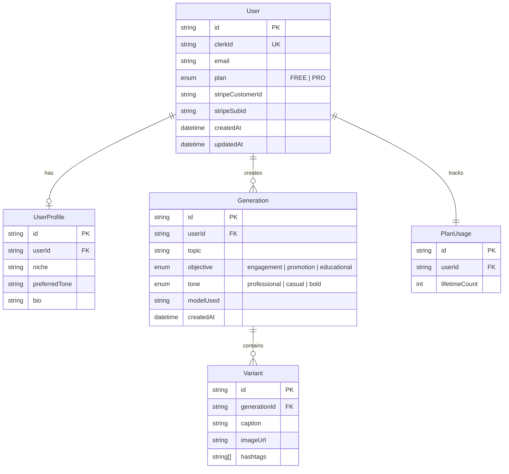
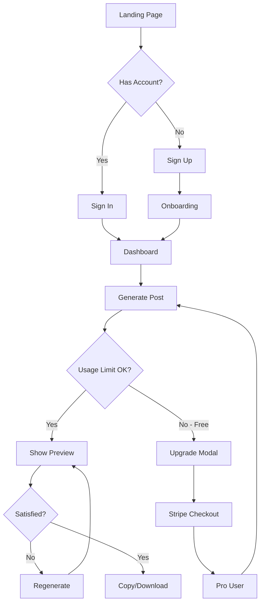
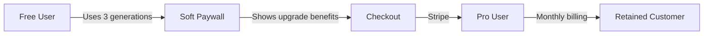

# PostGen AI — MVP Development Guide

> **"See your LinkedIn post before you publish it"**

---

## 📋 Table of Contents

1. [Product Overview](#-product-overview)
2. [Target Users](#-target-users)
3. [Core Value Proposition](#-core-value-proposition)
4. [MVP Scope](#-mvp-scope)
5. [Tech Stack](#-tech-stack)
6. [Database Schema](#-database-schema)
7. [User Flow & Routes](#-user-flow--routes)
8. [Generator Screen](#-generator-screen)
9. [API Endpoints](#-api-endpoints)
10. [AI Prompts](#-ai-prompts)
11. [Pricing Strategy](#-pricing-strategy)
12. [Success Metrics](#-success-metrics)
13. [Development Phases](#-development-phases)

---

## 🎯 Product Overview

| Attribute | Details |
|-----------|---------|
| **Name** | PostGen AI |
| **Tagline** | "See your LinkedIn post before you publish it" |
| **MRR Target** | $1,000 |
| **Timeline** | 3 months |
| **Required Pro Users** | 67 users @ $15/month |

---

## 👥 Target Users

| Segment | Description |
|---------|-------------|
| **Primary** | LinkedIn creators who post regularly and want polished, professional content |
| **Secondary** | Indie hackers, founders, consultants building personal brands |

---

## 💎 Core Value Proposition

1. **Generate LinkedIn-ready captions** — AI-powered, hook-driven content
2. **Generate 1 professional image** — On-brand, clean visuals
3. **Show realistic LinkedIn post preview** — See exactly how it will look
4. **Copy or download in seconds** — Zero friction publishing workflow

---

## 📦 MVP Scope

### ✅ In Scope

| Feature | Description |
|---------|-------------|
| LinkedIn Posts | Caption + image generation |
| Preview | Realistic LinkedIn post preview |
| Free Tier | 3 lifetime generations |
| Pro Tier | Unlimited generations @ $15/month |

### ❌ Out of Scope (Future Iterations)

- Facebook & Instagram support
- Scheduling functionality
- Team collaboration
- Engagement scoring
- Multiple image variants
- Agency plan

---

## 🛠 Tech Stack

### Frontend & Backend

| Category | Technology |
|----------|------------|
| **Framework** | Next.js 14 (App Router) |
| **Language** | TypeScript |
| **Styling** | Tailwind CSS + shadcn/ui |

### Database

| Category | Technology |
|----------|------------|
| **Provider** | Neon Postgres |
| **ORM** | Prisma |

### Authentication

| Category | Technology |
|----------|------------|
| **Provider** | Clerk |
| **Methods** | Passwordless email, Google, LinkedIn |

### Payments

| Category | Technology |
|----------|------------|
| **Provider** | Stripe |
| **Features** | Checkout, Subscriptions, Customer Portal |

### AI Services

| Purpose | Provider | Model |
|---------|----------|-------|
| **Text Generation** | OpenAI | GPT-4o-mini (primary) |
| **Text Fallback** | Anthropic | Claude Sonnet |
| **Image Generation** | OpenAI | DALL·E 3 |

> **Image Resolution:**
> - Free: 512×512
> - Pro: 1024×1024

### Infrastructure

| Category | Technology |
|----------|------------|
| **Deployment** | Vercel |
| **Background Jobs** | Vercel Cron + Upstash Redis |
| **Analytics** | PostHog |

---

## 🗄 Database Schema

### Entity Relationship Diagram



### Prisma Schema

```prisma
// schema.prisma

generator client {
  provider = "prisma-client-js"
}

datasource db {
  provider = "postgresql"
  url      = env("DATABASE_URL")
}

enum Plan {
  FREE
  PRO
}

enum Objective {
  engagement
  promotion
  educational
}

enum Tone {
  professional
  casual
  bold
}

model User {
  id               String       @id @default(cuid())
  clerkId          String       @unique
  email            String       @unique
  plan             Plan         @default(FREE)
  stripeCustomerId String?
  stripeSubId      String?
  createdAt        DateTime     @default(now())
  updatedAt        DateTime     @updatedAt

  profile     UserProfile?
  generations Generation[]
  usage       PlanUsage?
}

model UserProfile {
  id            String  @id @default(cuid())
  userId        String  @unique
  niche         String?
  preferredTone String?
  bio           String?

  user User @relation(fields: [userId], references: [id], onDelete: Cascade)
}

model Generation {
  id        String    @id @default(cuid())
  userId    String
  topic     String
  objective Objective
  tone      Tone
  modelUsed String
  createdAt DateTime  @default(now())

  user     User      @relation(fields: [userId], references: [id], onDelete: Cascade)
  variants Variant[]
}

model Variant {
  id           String   @id @default(cuid())
  generationId String
  caption      String   @db.Text
  imageUrl     String
  hashtags     String[]

  generation Generation @relation(fields: [generationId], references: [id], onDelete: Cascade)
}

model PlanUsage {
  id            String @id @default(cuid())
  userId        String @unique
  lifetimeCount Int    @default(0)

  user User @relation(fields: [userId], references: [id], onDelete: Cascade)
}
```

---

## 🧭 User Flow & Routes

### Public Routes

| Route | Purpose | Key Sections |
|-------|---------|--------------|
| `/` | Landing page | Hero, Features, Pricing, CTA |

### Authentication Routes

| Route | Purpose |
|-------|---------|
| `/sign-up` | User registration (Clerk) |
| `/sign-in` | User login (Clerk) |
| `/onboarding` | Profile setup (niche, tone, bio) |

### App Routes (Protected)

| Route | Purpose |
|-------|---------|
| `/app` | Dashboard |
| `/app/generate` | Post generator |
| `/app/history` | Past generations |
| `/app/billing` | Subscription management |
| `/app/settings` | User settings |

### User Journey Flowchart



---

## ⚡ Generator Screen

### Input Fields

| Field | Type | Options |
|-------|------|---------|
| **Topic** | Textarea | Free text (required) |
| **Objective** | Dropdown | Engagement, Promotion, Educational |
| **Tone** | Dropdown | Professional, Casual, Bold |

### Action

**Button:** `Generate 3 LinkedIn posts`

### Output

| Element | Description |
|---------|-------------|
| **3 Caption Variants** | Different angles on the same topic |
| **1 Shared Image** | Professional, topic-relevant image |
| **LinkedIn Preview Cards** | Realistic preview of each variant |
| **Copy Caption** | One-click copy to clipboard |
| **Download Image** | Direct download of generated image |
| **Regenerate** | Create new variants (Pro only) |

### UI Mockup Structure

```
┌─────────────────────────────────────────────────────────────┐
│  📝 Create Your LinkedIn Post                               │
├─────────────────────────────────────────────────────────────┤
│  Topic                                                      │
│  ┌─────────────────────────────────────────────────────┐   │
│  │ What do you want to post about?                     │   │
│  │                                                     │   │
│  └─────────────────────────────────────────────────────┘   │
│                                                             │
│  Objective              Tone                                │
│  ┌──────────────┐       ┌──────────────┐                   │
│  │ Engagement ▼ │       │ Professional▼│                   │
│  └──────────────┘       └──────────────┘                   │
│                                                             │
│         [ ✨ Generate 3 LinkedIn Posts ]                    │
└─────────────────────────────────────────────────────────────┘

┌─────────────────────────────────────────────────────────────┐
│  🖼 Generated Image                                         │
│  ┌─────────────────────────────────────────────────────┐   │
│  │                                                     │   │
│  │              [AI Generated Image]                   │   │
│  │                                                     │   │
│  └─────────────────────────────────────────────────────┘   │
│                              [ ⬇ Download Image ]          │
└─────────────────────────────────────────────────────────────┘

┌───────────────┐ ┌───────────────┐ ┌───────────────┐
│  Variant 1    │ │  Variant 2    │ │  Variant 3    │
│  ───────────  │ │  ───────────  │ │  ───────────  │
│  [LinkedIn    │ │  [LinkedIn    │ │  [LinkedIn    │
│   Preview]    │ │   Preview]    │ │   Preview]    │
│               │ │               │ │               │
│  [📋 Copy]    │ │  [📋 Copy]    │ │  [📋 Copy]    │
└───────────────┘ └───────────────┘ └───────────────┘
```

---

## 🔌 API Endpoints

### Generation API

#### `POST /api/generate`

Generate new LinkedIn post variants.

**Request Body:**
```json
{
  "topic": "string",
  "objective": "engagement | promotion | educational",
  "tone": "professional | casual | bold"
}
```

**Flow:**
1. Authenticate user (Clerk)
2. Check usage limit (Free: 3 lifetime, Pro: unlimited)
3. Generate 3 captions via OpenAI GPT-4o-mini
4. Generate 1 image via DALL·E 3
5. Save to database
6. Return preview-ready payload

**Response:**
```json
{
  "success": true,
  "generation": {
    "id": "string",
    "variants": [
      {
        "id": "string",
        "caption": "string",
        "hashtags": ["string"]
      }
    ],
    "imageUrl": "string"
  },
  "remainingGenerations": "number | 'unlimited'"
}
```

#### `GET /api/generations`

Fetch user's generation history.

**Response:**
```json
{
  "generations": [
    {
      "id": "string",
      "topic": "string",
      "objective": "string",
      "tone": "string",
      "createdAt": "datetime",
      "variantCount": "number"
    }
  ]
}
```

#### `GET /api/generations/:id`

Fetch a specific generation with all variants.

### Billing API

#### `POST /api/stripe/checkout`

Create Stripe checkout session for Pro upgrade.

**Request Body:**
```json
{
  "priceId": "string",
  "successUrl": "string",
  "cancelUrl": "string"
}
```

#### `POST /api/stripe/webhook`

Handle Stripe webhook events.

**Events Handled:**
- `checkout.session.completed` — Upgrade user to Pro
- `customer.subscription.deleted` — Downgrade user to Free
- `customer.subscription.updated` — Sync subscription status

---

## 🤖 AI Prompts

### Text Generation Prompt

```
You are a LinkedIn content expert.
Generate a {tone} LinkedIn post about "{topic}".

Objective: {objective}
Max length: 300 words

Structure:
1. Strong hook (first line that stops the scroll)
2. Insight or value (2-3 key points)
3. Clear CTA (engagement driver)
4. 3–5 relevant hashtags

Output JSON:
{
  "caption": "The full post content...",
  "hashtags": ["#hashtag1", "#hashtag2", "#hashtag3"]
}
```

### Image Generation Prompt

```
Professional LinkedIn post image.
Topic: {topic}
Style: clean, modern, high-contrast, corporate-friendly
No logos, no watermarks, no text overlays
Square format (1:1 aspect ratio)
Suitable for professional social media
```

---

## 💰 Pricing Strategy

### Free Plan

| Attribute | Value |
|-----------|-------|
| **Price** | $0 |
| **Generations** | 3 (lifetime) |
| **Features** | Caption generation, 1 image per post, LinkedIn preview |
| **Image Resolution** | 512×512 |

### Pro Plan

| Attribute | Value |
|-----------|-------|
| **Price** | $15/month |
| **Generations** | Unlimited |
| **Features** | Everything in Free + High-res images, Full history, Regenerate |
| **Image Resolution** | 1024×1024 |

### Conversion Strategy



---

## 📊 Success Metrics

### First 30 Days

| Metric | Target | Measurement |
|--------|--------|-------------|
| **Signups** | 100 | Total registered users |
| **Pro Conversion Rate** | 20% | Free → Pro conversions |
| **Retention** | 80% | Users who generated 2+ posts |
| **Generation Time** | < 5s | P95 latency for full generation |

### 3-Month Goal

| Metric | Target |
|--------|--------|
| **MRR** | $1,000 |
| **Pro Users** | 67 |
| **Churn Rate** | < 10% |

---

## 🚀 Development Phases

### Phase 1: Foundation (Week 1-2)

- [ ] Initialize Next.js 14 project with App Router
- [ ] Configure TypeScript, Tailwind CSS, shadcn/ui
- [ ] Set up Neon Postgres + Prisma
- [ ] Implement Clerk authentication
- [ ] Create database schema and migrations
- [ ] Build basic layout and navigation

### Phase 2: Core Features (Week 3-4)

- [ ] Build landing page (Hero, Features, Pricing)
- [ ] Implement onboarding flow
- [ ] Create generator UI
- [ ] Integrate OpenAI GPT-4o-mini for captions
- [ ] Integrate DALL·E 3 for images
- [ ] Build LinkedIn preview component
- [ ] Implement copy/download functionality

### Phase 3: Monetization (Week 5-6)

- [ ] Integrate Stripe Checkout
- [ ] Implement subscription webhooks
- [ ] Build billing management page
- [ ] Create usage tracking system
- [ ] Implement paywall for free users

### Phase 4: Polish & Launch (Week 7-8)

- [ ] Add generation history page
- [ ] Implement settings page
- [ ] Set up PostHog analytics
- [ ] Performance optimization
- [ ] Error handling & edge cases
- [ ] Testing & QA
- [ ] Deploy to Vercel
- [ ] Launch! 🎉

---

## 📁 Recommended Project Structure

```
postgen-ai/
├── app/
│   ├── (auth)/
│   │   ├── sign-in/[[...sign-in]]/page.tsx
│   │   ├── sign-up/[[...sign-up]]/page.tsx
│   │   └── onboarding/page.tsx
│   ├── (marketing)/
│   │   ├── layout.tsx
│   │   └── page.tsx
│   ├── app/
│   │   ├── layout.tsx
│   │   ├── page.tsx
│   │   ├── generate/page.tsx
│   │   ├── history/page.tsx
│   │   ├── billing/page.tsx
│   │   └── settings/page.tsx
│   ├── api/
│   │   ├── generate/route.ts
│   │   ├── generations/
│   │   │   ├── route.ts
│   │   │   └── [id]/route.ts
│   │   ├── stripe/
│   │   │   ├── checkout/route.ts
│   │   │   └── webhook/route.ts
│   │   └── webhooks/
│   │       └── clerk/route.ts
│   ├── layout.tsx
│   └── globals.css
├── components/
│   ├── ui/                    # shadcn/ui components
│   ├── layout/
│   │   ├── header.tsx
│   │   ├── footer.tsx
│   │   └── sidebar.tsx
│   ├── marketing/
│   │   ├── hero.tsx
│   │   ├── features.tsx
│   │   └── pricing.tsx
│   ├── generator/
│   │   ├── input-form.tsx
│   │   ├── variant-card.tsx
│   │   └── linkedin-preview.tsx
│   └── shared/
│       ├── loading.tsx
│       └── error-boundary.tsx
├── lib/
│   ├── db.ts                  # Prisma client
│   ├── openai.ts              # OpenAI client
│   ├── stripe.ts              # Stripe client
│   └── utils.ts               # Utility functions
├── hooks/
│   ├── use-generation.ts
│   └── use-subscription.ts
├── types/
│   └── index.ts
├── prisma/
│   └── schema.prisma
├── public/
│   └── ...
├── .env.local
├── .env.example
├── next.config.js
├── tailwind.config.js
├── tsconfig.json
└── package.json
```

---

## 🔐 Environment Variables

```env
# .env.example

# Database
DATABASE_URL="postgresql://..."

# Clerk Authentication
NEXT_PUBLIC_CLERK_PUBLISHABLE_KEY="pk_..."
CLERK_SECRET_KEY="sk_..."
NEXT_PUBLIC_CLERK_SIGN_IN_URL="/sign-in"
NEXT_PUBLIC_CLERK_SIGN_UP_URL="/sign-up"
NEXT_PUBLIC_CLERK_AFTER_SIGN_IN_URL="/app"
NEXT_PUBLIC_CLERK_AFTER_SIGN_UP_URL="/onboarding"
CLERK_WEBHOOK_SECRET="whsec_..."

# OpenAI
OPENAI_API_KEY="sk-..."

# Anthropic (Fallback)
ANTHROPIC_API_KEY="sk-ant-..."

# Stripe
STRIPE_SECRET_KEY="sk_..."
STRIPE_WEBHOOK_SECRET="whsec_..."
NEXT_PUBLIC_STRIPE_PUBLISHABLE_KEY="pk_..."
STRIPE_PRO_PRICE_ID="price_..."

# PostHog
NEXT_PUBLIC_POSTHOG_KEY="phc_..."
NEXT_PUBLIC_POSTHOG_HOST="https://app.posthog.com"

# App
NEXT_PUBLIC_APP_URL="http://localhost:3000"
```

---

## ✅ Pre-Launch Checklist

- [ ] All environment variables configured
- [ ] Clerk webhooks set up for user sync
- [ ] Stripe webhooks configured and tested
- [ ] Database migrations applied
- [ ] Error monitoring set up (e.g., Sentry)
- [ ] Analytics tracking verified
- [ ] Mobile responsiveness tested
- [ ] Performance benchmarks met (< 5s generation)
- [ ] Legal pages added (Privacy Policy, Terms of Service)
- [ ] SEO meta tags configured
- [ ] Open Graph images created
- [ ] Production deployment on Vercel
- [ ] Custom domain configured
- [ ] SSL certificate active

---

## 📝 Notes & Decisions

> **Why 3 lifetime generations for free?**
> This gives users enough to experience the value without gaming the system. It creates urgency to upgrade while still providing a meaningful trial.

> **Why GPT-4o-mini over GPT-4?**
> Cost efficiency. For short-form content like LinkedIn posts, GPT-4o-mini provides excellent quality at a fraction of the cost, enabling better margins.

> **Why only 1 image per generation?**
> MVP simplicity. Multiple image variants add complexity without proportionally increasing value for the initial launch.

---

*Last Updated: January 2026*
